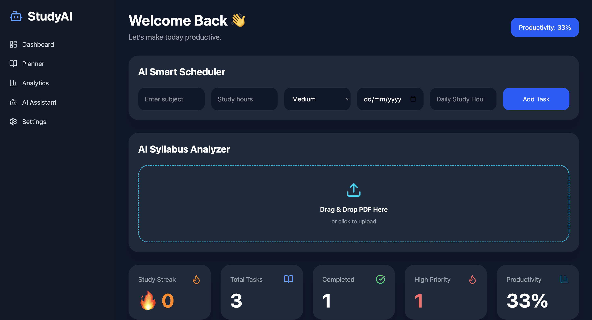
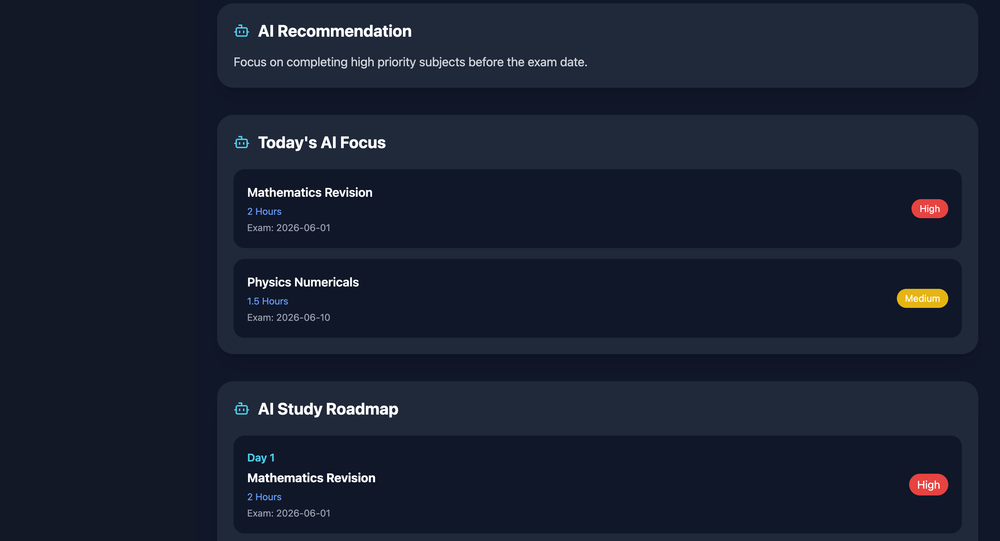
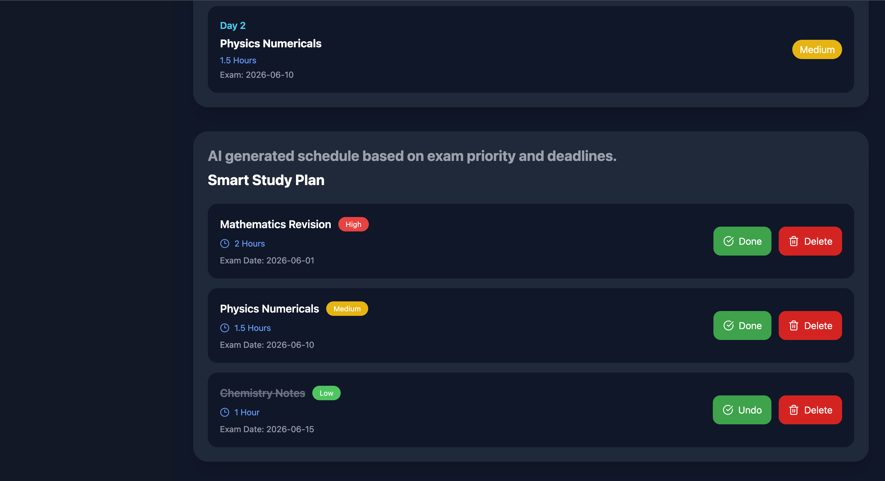

# AI Study Planner 🚀

A modern AI-powered productivity dashboard built using React, Vite, and Tailwind CSS.

This application helps students manage study tasks, track productivity, organize priorities, and improve daily study consistency with a clean and interactive UI.

---

# ✨ Features

- ✅ Add study tasks
- ✅ Delete tasks
- ✅ Mark tasks as completed
- ✅ Productivity tracking
- ✅ Daily progress bar
- ✅ AI recommendation section
- ✅ Task priority system
- ✅ Local storage support
- ✅ Responsive modern UI
- ✅ Sidebar navigation
- ✅ Interactive dashboard cards

---

# 🛠️ Tech Stack

- React.js
- Vite
- Tailwind CSS
- Lucide React Icons
- JavaScript

---

# 📸 Screenshots

## Dashboard



---

## AI Roadmap




---

## Study Plan




---

# 🚀 Installation

Clone the repository:

```bash
git clone https://github.com/DevByPawan/AI-Study-Planner.git
```

Go to project folder:

```bash
cd AI-Study-Planner
```

Install dependencies:

```bash
npm install
```

Run the development server:

```bash
npm run dev
```

---

# 📈 Future Improvements

- AI-generated schedules
- Pomodoro timer
- User authentication
- Backend integration
- Cloud database
- Dark/light mode
- Calendar integration

---

# 👨‍💻 Author

Developed by Pawan Agrahari

GitHub:
https://github.com/DevByPawan
